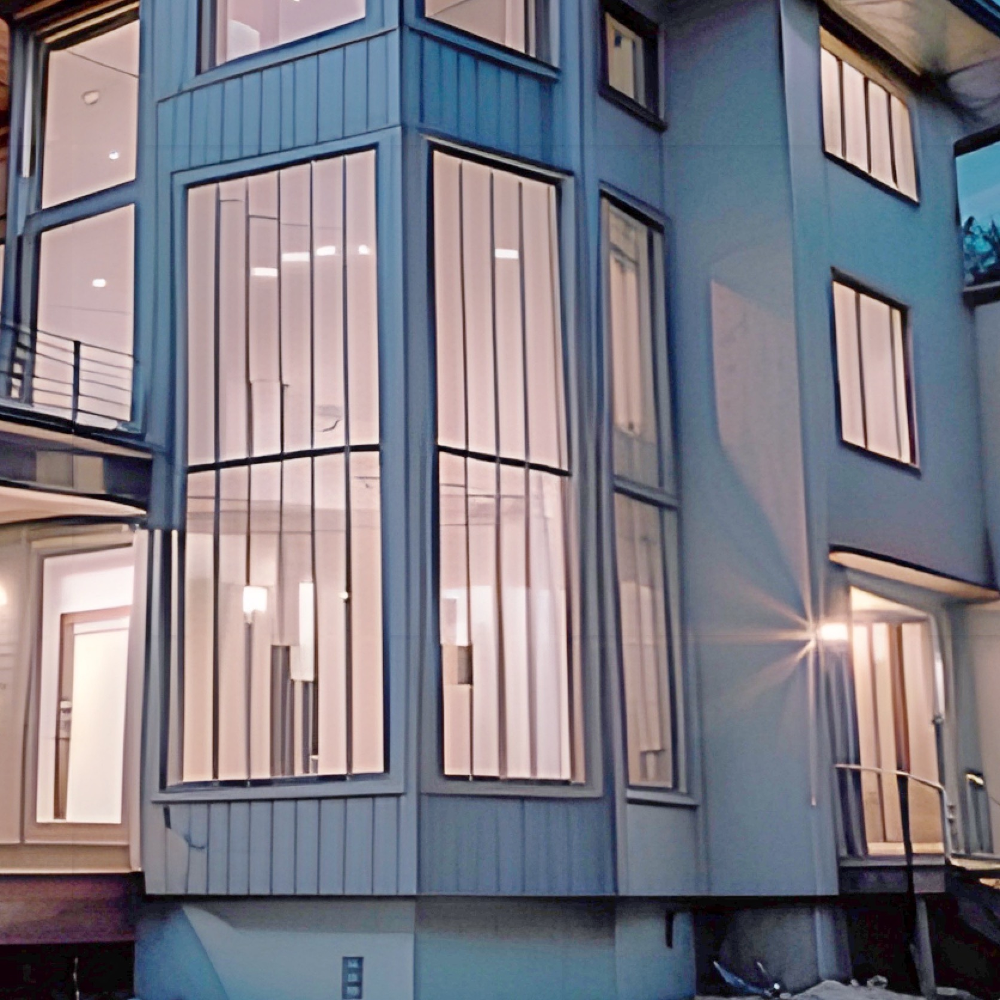
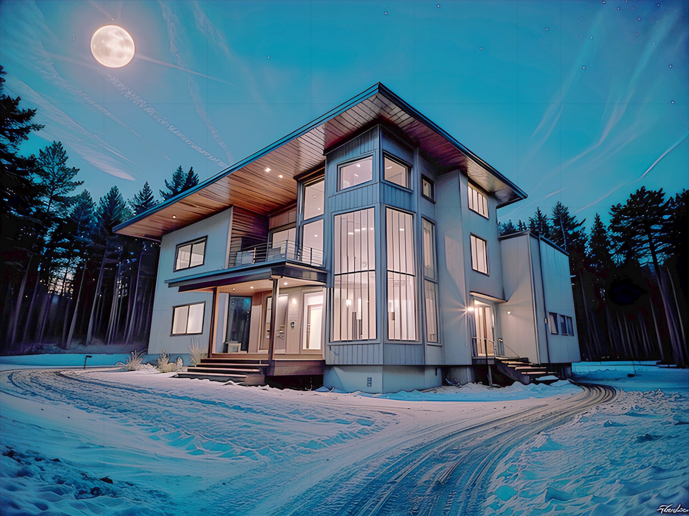

# UppScale

UppScale is a free image processing application that leverages AI to enhance and upscale images. It provides powerful tools for improving image quality, enhancing lighting, and increasing resolution.

## Features

- **Super Resolution**: Upscale low-resolution images to improve image quality and enhance details.
- **Light Enhancement**: Enhance lighting in dark images and bring out details in shadow areas.
- **Flexible Processing Options**: Configure parameters like tile size and overlap to customize the processing.
- **User-Friendly Interface**: Simple and intuitive interface for easy image processing.

## How to Use

1. **Choose Processing Type**: Select either "Super Resolution" or "Light Enhancement" to apply the desired image processing technique.
2. **Configure Processing Parameters**: Adjust the tile size, overlap, and other parameters to fine-tune the processing.
3. **Load Image**: Load the image you want to process from your device.
4. **Process Image**: Initiate the image processing to enhance and upscale the image.
5. **Save or Share**: Save the processed image to your device or share it with others.

## Demo

| Original Image | Upscaled Image | Light Enhanced Image |
| --- | --- | --- |
|  |  |  |
|  |  |  |

## Installation

1. Clone the repository to your local machine.
2. Open the project in Xcode.
3. Build and run the application on your iOS device or simulator.

## Requirements

- iOS 16.0+
- Xcode 14.0+
- Swift 5

## Credits

UppScale was developed by [@pavlovskyive](https://github.com/pavlovskyive).

## Contributing

Contributions are welcome! If you find any issues or have suggestions for improvements, please open an issue or submit a pull request.

## Contact

If you have any questions or inquiries, feel free to contact me at [vpavlovskyi@gmail.com]

## License

This project is licensed under the [Apache License, Version 2.0](LICENSE).
